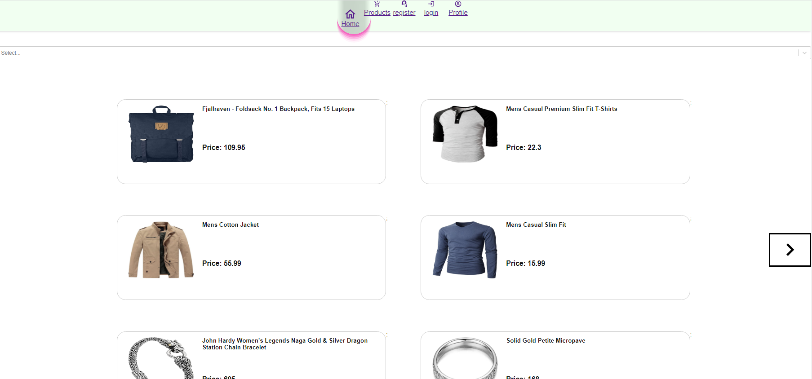
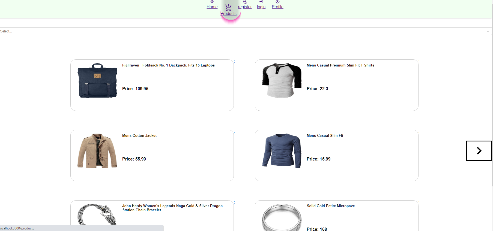
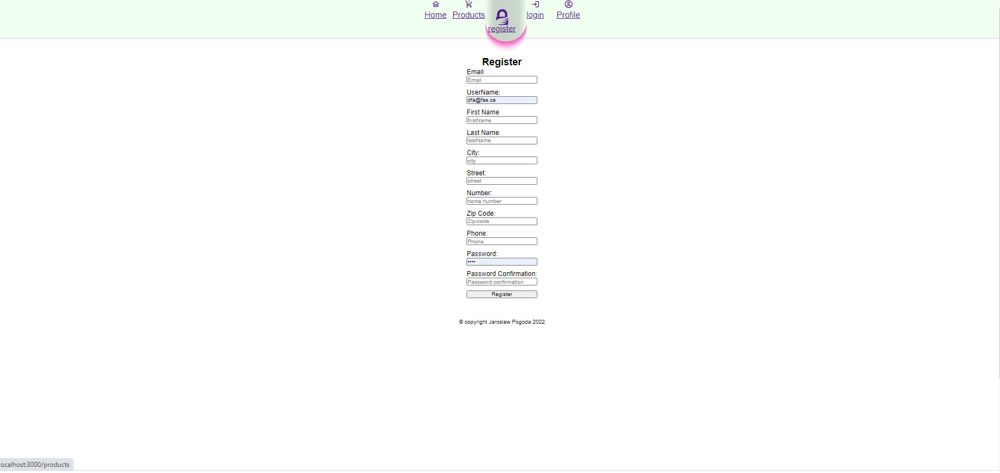
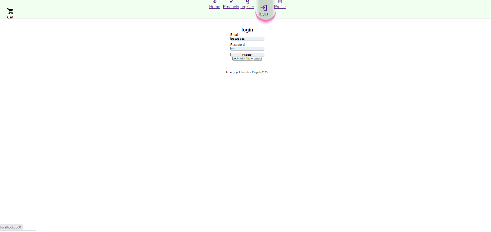
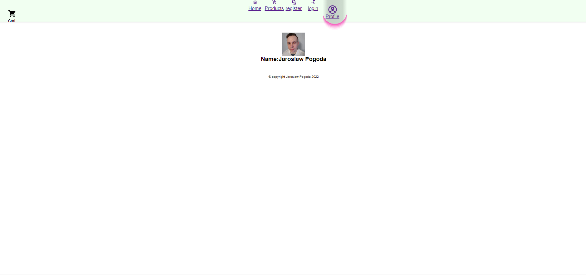
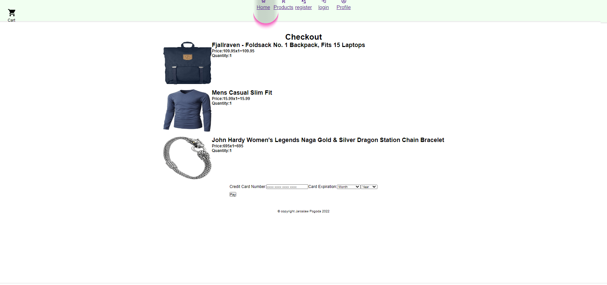
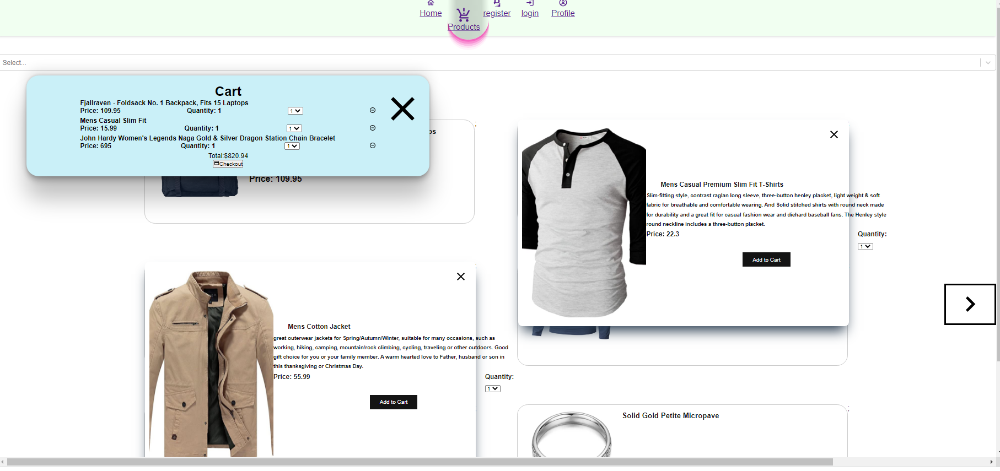

# Title: Starting intiial build of JPenny-fake-store-app
This is my end of mod 2 project. I have decided to create a web app that is going to contain most of features found on today's ecommerce sites.
for this project I will be using 3 API's:
- fake store API https://fakestoreapi.com/
- fake shop API https://www.fakeshop-api.com/
- Auth0 authentication API https://auth0.com/docs/api

## Hosted:
Netlify: https://frosty-tereshkova-a1594c.netlify.app/
## Objective:

purpose of this app is to test my abilities to create responsive web app using api that provides fake internet store data about products cart prices.
## Notes:
It is my understanding that some of the features should not be in front-end and I plan to move some of features to backend. Yet since one of the objective of this mod project was to build front-end only app I decided to create as many features that I could.
### Todo:
##### 1.Find api.
##### Completed 2. clean and establish directories.
##### Completed 3. Crate repository  and connect,
##### Completed 4. install axios
##### Completed 5. Created getDataAllProduct function
##### Completed 6. Create Product Component
##### Completed 7. Render all products.
##### Completed 8. Create Pop up product component
##### Completed 9. add and adjust information on the pop up.
##### completed 10. get all Categories.
##### Completed 11. create category list.
##### completed 12. create categories.
##### completed 13. create pages and category bar.
##### completed 14. Create buttons and navBar
##### completed 15. add styles to pages and navbars.
##### completed 16. add fake-shop api
##### completed 17. add auth0 authentication
##### completed 18. create cart and add react-icons
##### completed 19. create styled-components and add navbar animation.
##### completed 20. correct styles 
##### completed 21-22. checkout and cart page
##### 23.   update style and add more information to profile
### Used Api:

- fake store API https://fakestoreapi.com/
- fake shop API https://www.fakeshop-api.com/
- Auth0 authentication API https://auth0.com/docs/api
### Screenshots
home pag

products page

register page

checkout page

products page

checkout page

cart page

### Other features to be implemented:
##### Payment system,
##### Order System,
##### Order Tracking System 
##### Order Cancellation
##### ADD paypal payment system.
##### ADs Banner and featured items.
##### deals pages
##### Customer support page and contact us

## By Jaroslaw Pogoda
### Checkout my GitHub repository https://github.com/JaroslawPogoda for other projects and
### also checkout my LinkedIn https://www.linkedin.com/in/jaroslaw-pogoda/ and lets connect.
